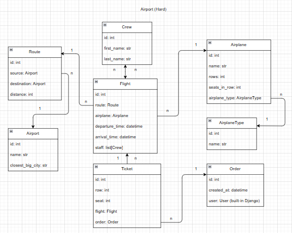
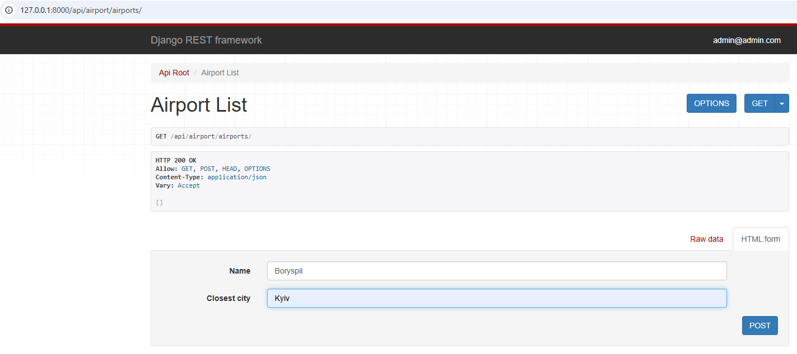
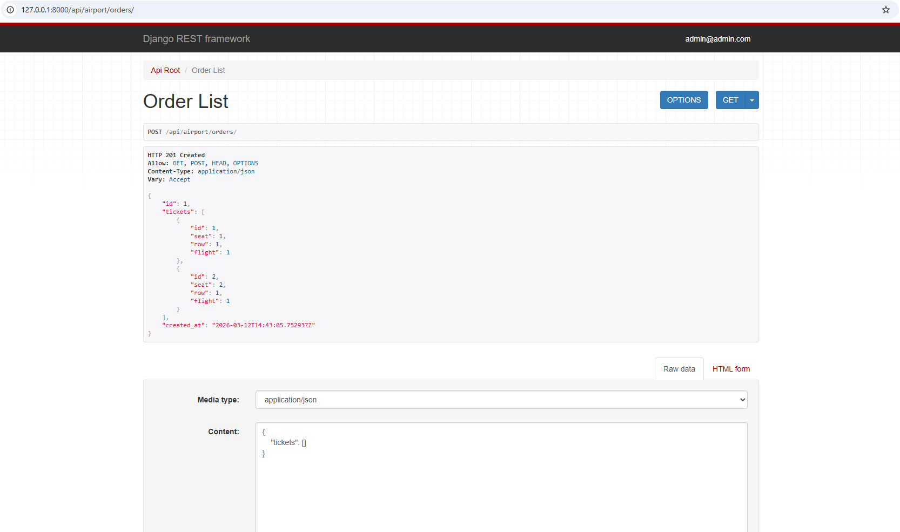
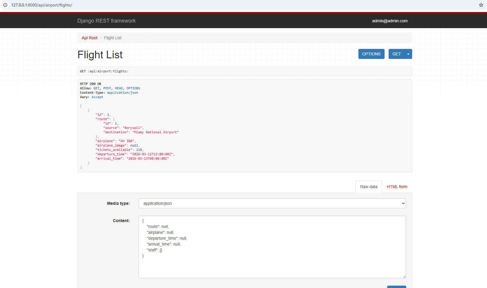
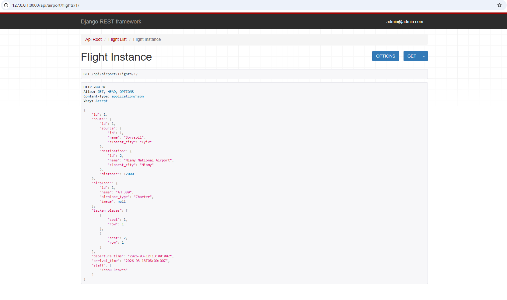

# Airport API

A portfolio project of Airport API, based on DRF + Docker

## Install process using GitHub

Install PostgreSQL and create your DB

```bash
git clone https://github.com/serg121192/airport_api.git
cd airport_api
python -m venv venv
source venv/bin/activate (MacOS)
or venv\Scripts\activate (Windows)
python.exe -m pip install --upgrade pip
pip install -r requirements.txt
set POSTGRES_HOST=<your db hostname>
set POSTGRES_name=<your db name>
set POSTGRES_USER=<your db username>
set POSTGRES_PASSWORD=<your db user password>
set POSTGRES_PORT=<your db port>
set SECRET_KEY=<your secret key>
python manage.py migrate
python manage.py runserver
```

## Run with DOCKER

!!! Docker should be installed !!!

```bash
docker-compose build
docker-compose up
```

If you're interested in checking functionality test coverage you can do it via Docker too:

```bash
docker-compose run airport sh -c "coverage erase && coverage run --source=/app/airport -m pytest && coverage html
```

Then the dir ``htmlcov`` will be created in the project root with stats files. You can see these stats in your web browser if open ``local`` file with path: ``file:///<path_to_the_project>/htmlcov/index.html``

## Getting Access

+ create user via /api/user/register/
+ get access token via /api/user/token

You also need ``Postman`` or ``ModHeader`` apps/extensions for your user easy installation :-)

## Features

+ JWT authentication
+ Admin panel: /admin/
+ Documentation is located at:
  + api/doc/swagger/
  + api/doc/redoc/
+ Managing orders and tickets
+ Creating airplanes with images
+ Creating flights and routes
+ Creating airports
+ Filtering flights and airplanes

## Project schema



## API Functionality Images

+ Airport create form
  

+ Order create with tickets
  

+ Flight List
  

+ Flight Detailed Info
  
